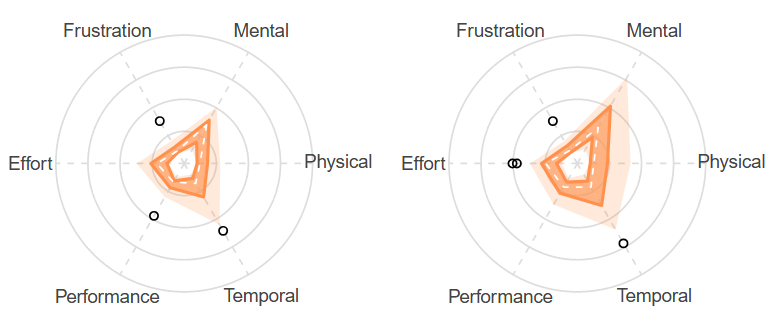
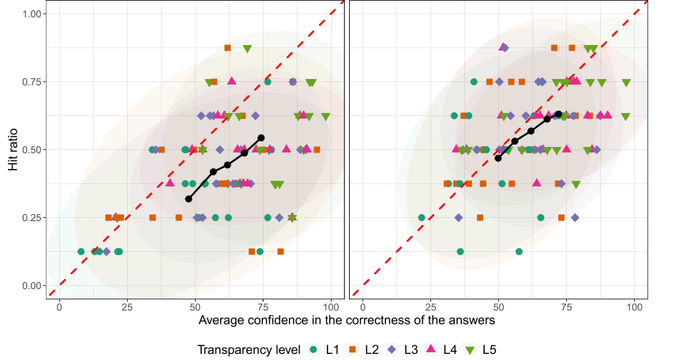

# 🧠 Modular Survey Framework for Human–Machine Interaction Research

**Clark Borst**\
*Delft University of Technology*\
*Faculty of Aerospace Engineering*\
*Department: Control & Operations*\
*Section: Control and Simulation*\
*2629 HS, Delft, The Netherlands*\
https://cs.lr.tudelft.nl

---

This repository provides validated **human factors and cognitive engineering surveys** for 
evaluating **human–machine interaction**, such as: decision-support systems, human-automation interaction, 
human-autonomy teaming, human-AI teaming, etc.
Each survey is implemented as a **standalone HTML survey** that runs in your browser and can be embedded 
in Python or JavaScript applications using `<iframe>` elements. 

Besides a set of validated surveys from literature, a customizable general-purpose survey is also available, enabling
researchers to easily create custom HTML surveys.

All surveys send structured JSON results to the host via `window.postMessage()` for seamless data collection. 

Alternatively, the survey can also be used standalone and automatically download a JSON 
file (see instructions in the section *Integration with Applications*).

---

### Key benefits over cloud-based platforms

While cloud-based survey platforms are convenient for rapid
data collection, they often rely on **remote data storage** and **closed architectures**. This HTML/JavaScript-based modular survey framework
provides comparable flexibility and user experience, but with **full researcher control** over data, design, and integration.

#### 🗂️ 1. Local Data Ownership & Privacy
- **No external servers required** — all survey data are stored and processed **locally** in the participant’s browser.
- Researchers can choose to **download results as JSON** or transmit them to their own **secure local or institutional server**.
- **No third-party tracking**, cookies, or cloud dependencies, ensuring compliance with **GDPR** and institutional ethics policies.

#### 🧱 2. Modular, Transparent, and Extensible Design
- Surveys are defined in **plain JavaScript configuration objects** — no hidden code, proprietary APIs, or vendor lock-in.
- Open a survey HTML file in your favourite editor (e.g., VSCode) and add your survey questions. 
- Researchers can easily add new question types (e.g., Likert, sliders, dropdowns, open text, or matrix tables).
- Each survey (e.g., **NASA-TLX**, **Trust**, **Understanding**, **SART**, etc.) is a **self-contained HTML module** that can be embedded using an `<iframe>` or imported into larger experimental interfaces.

#### 💻 3. Full Offline Capability
- Surveys can run entirely **offline**, directly from a local file or USB drive.
- Perfect for lab studies, field experiments, or sensitive domains (e.g., aviation, defense, healthcare) where **internet connectivity or external data transfer** is restricted.

#### ⚙️ 4. Researcher-Controlled Data Flow
- Output is structured in standardized **JSON** format for seamless import into **Python**, **R**, or **MATLAB**.
- Optional participant and condition IDs can be included in both the data file and filename for easy tracking across sessions.
- Results can be automatically downloaded, posted to a local server, or sent to a parent experiment controller via `window.postMessage()`.

#### 🧩 5. Integration with Experimental Software
- Embeddable via `<iframe>` in **Python (Flask, PsychoPy, jsPsych)** or **JavaScript**-based platforms.
- Easy synchronization with human-in-the-loop experiments and simulators.
- The modular approach allows researchers to switch between instruments (e.g., from NASA-TLX to Trust) **without re-coding** the data pipeline.

#### 🧠 6. Tailored to Human–Machine Interaction Research
- Designed for **Human–Machine Interaction research**.
- Supports **calibration metrics**, **metacognitive confidence**, and **subjective ratings** for trust, workload, understanding, and human–AI/autonomy teamwork.

---

## 📜 License and Citation

This open-source survey framework and accompanying HTML templates are provided for **academic research and commercial use** under
the **GPL-3** license.

You are free to download and/or fork the project and:
- **Use** the survey templates in research studies or teaching
- **Modify** or extend the code (e.g., add new question types, languages, or sections)
- **Share** adapted versions under the same license

You must:
- **Attribute** the original authors of the surveys
- **Cite** this repository (see citation below)
- **Distribute adaptations** under the same license

---

### 📖 Citation

If you use or adapt this survey framework in your research, please cite it as follows:

#### APA format
> Borst, C. (2025). *Modular Open-Source Survey Framework for Human–Machine Interaction Research.*  
> Delft University of Technology. Available at: [https://github.com/clarkborst/hmisurveys](https://github.com/clarkborst/hmisurveys)

#### BibTeX
```bibtex
@misc{Borst_HMISurveyFramework_2025,
  author       = {Clark Borst},
  title        = {Modular Open-Source Survey Framework for Human–Machine Interaction Research},
  year         = {2025},
  publisher    = {{D}elft {U}niversity of {T}echnology},
  doi          = {},
  howpublished = {\url{https://github.com/clarkborst/hmisurveys}},
  url          = {\url{https://github.com/clarkborst/hmisurveys}},
  note         = {GPL-3 license.}
}
```
---

## 📊 Included Surveys

### 🛰️ 1a. Workload: NASA-TLX — Task Load Index
**Purpose:** Measures **subjective workload** across six dimensions:  
*Mental, Physical, Temporal Demand, Performance, Effort,* and *Frustration.*

**Method:** Participants rate each dimension on a 0–100 scale and perform 15 pairwise comparisons to weight their importance.

**Scientific Basis:**  
Hart, S. G., & Staveland, L. E. (1988). *Development of NASA-TLX (Task Load Index): Results of empirical and theoretical research.* Advances in Psychology, 52, 139–183.

**Output:** Weighted workload score (0–100) and per-dimension values.

**Credits:** 
- Original version by Keith Vertanen https://www.keithv.com/software/nasatlx/
- Translated into modern Javascript for improved browser integration.

**IMPORTANT:** This survey should not be modified to maintain scientific validity.

**NOTE:** Both the original 2-part NASA-TLX and a simplified 1-part TLX (only scales) are available.

**Tip:** Radar box plots are a nice way to portray the TLX scales



C. Hamamura, “radarBoxplot: Implementation of the Radar-Boxplot.” CRAN, Oct. 2021. doi: https://zenodo.org/doi/10.5281/zenodo.11373029

---

### 🧠 1b. Workload: Rating Scale Mental Effort (RSME)

**Purpose:**  
The **Rating Scale Mental Effort (RSME)** measures the **subjective mental effort** a person perceives during task performance.  
It is a **one-dimensional rating scale** with language-specific anchor/calibration points.
RSME is a fast and easy-to-use alternative (for participants) compared to the two-dimensional NASA-TLX. 

**Scientific Basis:**
- Zijlstra, F. R. H. & Van Doorn, L. (1985). *The construction of a scale to measure perceived effort.* Delft University of Technology, Department of Philosophy and Social Sciences.
- Zijlstra, F. R. H. (1993). *Efficiency in work behaviour: A design approach for modern tools.* Delft University Press.

**Output Example:**
- RSME score and text description

**IMPORTANT:** This survey should not be modified to maintain scientific validity.

**NOTE:** Both English and Dutch versions are available.

---

### 🧠 1c. Workload: Modified Cooper-Harper (MCH)

**Purpose:**  
The **Modified Cooper-Harper (MCH)** measures the **subjective mental effort** a person perceives during task performance.  
It is a **one-dimensional rating scale** that follows a **decision tree**.
MCH is a fast and easy-to-use alternative to the RSME and NASA-TLX.

**Scientific Basis:**
- Cooper, G. E., & Harper, R. P. (1969). *The use of pilot rating in the evaluation of aircraft handling qualities (NASA TN D-5153)*. National Aeronautics and Space Administration (NASA)
- Wierwille, W. W., & Casali, J. G. (1983). *A validated rating scale for global mental workload measurement applications*. Proceedings of the Human Factors Society Twenty-Seventh Annual Meeting, 1983, 129-133.

**Output:**
- MCH score

**IMPORTANT:** This survey should not be modified to maintain scientific validity.

**NOTE:** Other variants of MCH exist, for example, one for rating the *acceptance* of a display support tool. Those follow the 
exact same decision tree logic, but with different text descriptions.

---
### Handling Qualities (original Cooper-Harper rating scale)

The original Cooper-Harper rating scale for pilot assessment of aircraft **handling qualities** is also included.

**Scientific Basis:**
- Cooper, G. E., & Harper, R. P. (1969). *The use of pilot rating in the evaluation of aircraft handling qualities (NASA TN D-5153)*. National Aeronautics and Space Administration (NASA)

**Output:**
- CH score for handling qualities

**IMPORTANT:** This survey should not be modified to maintain scientific validity.

---

### 🧭 2a. Situation Awareness Rating Technique (SART)
**Purpose:**  
Measures **subjective situation awareness (SA)** — how effectively an operator perceives, comprehends, and anticipates the situation.  
Based on **Taylor (1989, 1990)** and **Endsley (1995)**, SART captures workload balance and mental resource management through three meta-factors:

| Category | Example Dimensions | Interpretation |
|-----------|-------------------|----------------|
| **Demand on Attentional Resources** | Instability, Complexity, Variability | How dynamic or demanding the environment was |
| **Supply of Attentional Resources** | Arousal, Concentration, Spare Capacity, Division of Attention | How much attention and cognitive resource were available |
| **Understanding of the Situation** | Information Quantity, Information Quality, Familiarity | How well the situation was comprehended |

**Computation:**

SART = (Understanding + Supply) - Demand

Higher scores indicate greater **situation awareness** (i.e., high understanding and attention, low demand).

**Scientific Basis:**
- Taylor, R. M. (1989). *Situational Awareness Rating Technique (SART): The development of a tool for aircrew systems design.* AGARD AMP Symposium on Situational Awareness in Aerospace Operations.
- Endsley, M. R. (1995). *Toward a theory of situation awareness in dynamic systems.* Human Factors, 37(1), 32–64.

**Output:**
- Mean scores for *Demand*, *Supply*, and *Understanding* (1–7 scale)
- Composite **SART Index** = (Understanding + Supply) − Demand

**IMPORTANT:** This survey should not be modified to maintain scientific validity.

---

### 🧭 2b. Situation Awareness (general)
**Purpose:**  
Measures **subjective situation awareness (SA)** — how effectively an operator perceives, comprehends, and anticipates the situation.  
Based on **Taylor (1989, 1990)** and **Endsley (1995)**.

| Category          | Example Dimensions                                                                              |                                                                            
|-------------------|-------------------------------------------------------------------------------------------------|
| **Perception**    | Perceiving the status, attributes, and dynamics of the relevant elements in a given environment |
| **Comprehension** | Understanding the significance of the information in light of one's goals                       |
| **Projection**    | Anticipating future events and their likely consequences                                        |


**Scientific Basis:**
- Endsley, M. R. (1995). *Toward a theory of situation awareness in dynamic systems.* Human Factors, 37(1), 32–64.

**Output:**
- Mean scores for *Perception*, *Comprehension*, and *Projection* (1–7 scale)

---

### 🤝 3. Trust (in Automation)
**Purpose:** Measures **user trust** toward automated systems, covering reliability, predictability, and faith.

**Scientific Basis:**
- Jian, J.-Y., Bisantz, A. M., & Drury, C. G. (2000). *Foundations for an empirically determined scale of trust in automated systems.*, Int. J. Cognitive Ergonomics, 4 (1), 53–71.

**Output:** Mean trust rating (1–7) across subscales.

**IMPORTANT:** This survey should not be modified to maintain scientific validity.

---

### ⚙️ 4. Technology Acceptance (TAM / TAM2)
**Purpose:** Measures **user acceptance** and **perceived usefulness/ease of use** of automated systems.

**Scientific Basis:**
- Davis, F. D. (1989). *Perceived usefulness, perceived ease of use, and user acceptance of information technology.*, MIS Quarterly, 13 (3), 319–340.
- Venkatesh, V., & Davis, F. D. (2000). *A theoretical extension of the technology acceptance model: TAM2.*, Management Science, 46 (2), 186–204.

**Output:** Composite acceptance (experimental!) score and subscale means (Usefulness, Ease of Use, Intention to Use).

---

### 🧩 5a. Understanding / Transparency
**Purpose:** Evaluates how well users **understand** a system’s reasoning and internal logic.  
This instrument combines two complementary subscales:

- **Perceived Understanding** — the *subjective feeling* of comprehension.
- **Factual / Conceptual Understanding** — *objective correctness* of the user’s mental model, tested via factual or multiple-choice questions.

**Why combine both?**  
According literature, understanding and explanations (in AI) serve both **epistemic** (truth-based) and **psychological** (comprehension-based) functions.  
A system that is factually transparent but not perceived as understandable fails to foster calibrated trust, while perceived understanding without factual basis can lead to overconfidence.  
By measuring both, one can assess how closely users’ mental models align with the (AI) system's true behavior.

**Scientific Basis:**
- Miller, T. (2019). *Explanation in Artificial Intelligence: Insights from the social sciences.*, Artificial Intelligence, 267, 1–38.
- Kulesza, T. et al. (2013). *Too much, too little, or just right? Ways explanations impact end users’ mental models of intelligent systems.*, Conference: IEEE Symposium on Visual Languages and Human-Centric Computing.
- S. Mohseni, N. Zarei, E. D. Ragan (2021). *A multidisciplinary survey and framework for design and evaluation of explainable ai systems.* ACM Transactions on Interactive Intelligent Systems (TiiS) 11 (3-4) (2021) 1–45.
- B. McGuinness (2004). *Quantitative analysis of situational awareness (quasa): Applying signal detection theory to true/false probes and self-ratings*,1250 (48) in: Command and Control Research and Technology Symposium, pp. 15–17.
- Lopes, P., Silva, E., Braga, C., Oliveira, T., & Rosado, L. (2022). *XAI Systems Evaluation: A Review of Human and Computer-Centred Methods*. Applied Sciences, 12(19), 9423. https://doi.org/10.3390/app12199423
- Elizabeth R. Tenney, Barbara A. Spellman, Robert J. MacCoun (2008). *The benefits of knowing what you know (and what you don’t): How calibration affects credibility*.
  Journal of Experimental Social Psychology, 44 (5), 1368-1375.


**Output:**
- *Perceived Understanding Mean* (1–7)
- *Factual Accuracy* (% correct)
- Experimental!! *Composite Understanding Index*  (average of scaled perceived + factual)

---

#### 🧮 Customizing the Understanding Scale

Researchers can easily **modify or extend the question set** in `understanding.html`.

Locate the configuration block:
```js
const questions = [
  // Subjective (Likert)
  { type: "likert", text: "I understood what the system was doing.", scale: "Perceived Understanding" },
  { type: "likert", text: "The system’s predictions were confusing or unpredictable.", scale: "Perceived Understanding", reverse: true },

  // Factual (True/False)
  { type: "factual", text: "The system used a distance threshold of 5 nautical miles to predict conflicts.", scale: "Factual Accuracy", correct: true },

  // Conceptual (Multiple Choice)
  { type: "conceptual",
    text: "What factor does the system prioritize when ranking conflicts?",
    options: ["Distance between aircraft", "Time-to-conflict", "Altitude difference", "Random selection"],
    correctIndex: 1 }
];
```

You can:
- Add or remove items by editing the array.
- Change type to "likert", "factual", or "conceptual".
- Provide correct or correctIndex for factual/conceptual items.
- Adjust question text to match your system (e.g., thresholds, decision rules).
- Optionally weight the components differently in the final composite score.

This enables each research group to tailor the survey to their specific support
system while keeping a consistent structure and JSON output format.

----

### 🧩 5b. Understanding + Metacognitive Confidence

**Purpose:**  
This survey assesses **factual and conceptual understanding** of how an automated system works, together with 
**metacognitive self-confidence** for each response. It measures not only *what users know* but also *how accurately 
they know that they know it* — capturing **calibrated understanding**.

**What It Measures:**

| Category | Description                                                        | Example Item                                                      | Response Type |
|-----------|--------------------------------------------------------------------|-------------------------------------------------------------------|----------------|
| **Factual Understanding** | Objective comprehension of system parameters, thresholds, or rules | “The system uses a 5 nm distance threshold to predict conflicts.” | True/False (radio buttons) |
| **Conceptual Understanding** | Understanding of principles and reasoning behind system behavior   | “The system’s conflict-detection logic depends primarily on…”     | Multiple-choice (dropdown) |
| **Metacognitive Confidence** | Self-rated confidence for each response (0–10)                     | “How confident are you in your answer?”                           | Slider (0–10) |


This survey quantifies **how well confidence aligns with correctness** — a key concept in metacognition research.  
An *ideal calibration* pattern is:

- ✅ **High confidence for correct answers**
- ⚠️ **Low confidence for incorrect answers**

The survey computes an experimental **Calibration Index** that penalizes overconfidence in wrong answers and underconfidence in correct ones.  
Lower calibration scores indicate **better self-awareness and understanding accuracy**.

#### Calibration index

The calibration index is computed as the mean difference between scaled correctness (0–10) and confidence ratings (0–10). Values near 
zero indicate good calibration, while negative (< 0) and positive (> 0) values reflect overconfidence and underconfidence, respectively.

---

**Tip:** Patterns in calibrated understanding can be portrayed in a scatter plot, with correct percentages on the y-axis and
confidence percentages on the x-axis. Data points on or close to the diagonal indicate good calibration. This has been applied in:

- Zou, Y., & Borst, C. (2025). *Algorithmic transparency in path planning: A visual approach to enhancing human understanding*. International Journal of Human-Computer Studies, 203(103573), 1–27. https://doi.org/10.1016/j.ijhcs.2025.103573




---

**Scientific Foundations:**

This instrument integrates research from **cognitive psychology**, **AI explainability**, and **trust calibration**:

- Miller, T. (2019). *Explanation in Artificial Intelligence: Insights from the social sciences.*, Artificial Intelligence, 267, 1–38.
- Kulesza, T. et al. (2013). *Too much, too little, or just right? Ways explanations impact end users’ mental models of intelligent systems.*, Conference: IEEE Symposium on Visual Languages and Human-Centric Computing.
- S. Mohseni, N. Zarei, E. D. Ragan (2021). *A multidisciplinary survey and framework for design and evaluation of explainable ai systems.* ACM Transactions on Interactive Intelligent Systems (TiiS) 11 (3-4) (2021) 1–45.
- B. McGuinness (2004). *Quantitative analysis of situational awareness (quasa): Applying signal detection theory to true/false probes and self-ratings*,1250 (48) in: Command and Control Research and Technology Symposium, pp. 15–17.
- Lopes, P., Silva, E., Braga, C., Oliveira, T., & Rosado, L. (2022). *XAI Systems Evaluation: A Review of Human and Computer-Centred Methods*. Applied Sciences, 12(19), 9423. https://doi.org/10.3390/app12199423
- Elizabeth R. Tenney, Barbara A. Spellman, Robert J. MacCoun (2008). *The benefits of knowing what you know (and what you don’t): How calibration affects credibility*.
  Journal of Experimental Social Psychology, 44 (5), 1368-1375.

Together, these works highlight that **true understanding** requires both accurate mental models 
and **appropriate confidence calibration**, enabling trustworthy human–machine interaction.

**Output Metrics:**

| Metric                 | Meaning                                                                                  | Example |
|------------------------|------------------------------------------------------------------------------------------|----------|
| **Factual Accuracy**   | % of correct factual items                                                               | 80% |
| **Conceptual Accuracy** | % of correct conceptual items                                                            | 75% |
| **Mean Confidence**    | Average self-rated confidence (0–10)                                                     | 7.2 |
| **Calibration Index**  | (Experimental!!) Difference between confidence and correctness (closer to zero = better) | 1.4 |

**Example:**

| Item | Correct (`s`) | Confidence (`c`) (0–10) | Contribution (`10·s − c`) |
| ---- | ------------- |------------------------| ----------------------- |
| 1    | 1             | 9                      | +1                      |
| 2    | 0             | 6                      | −6                      |
| 3    | 1             | 7                      | +3                      |

Calibration Index: `CI = (1 + (-6) + 3) / 3 = -0.67`

Interpretation: slightly negative, indicating mild overconfidence

---

### 🤖 6. Human–Autonomy Teaming (HAT)

**Purpose:**  
Assesses the perceived quality and effectiveness of **human–Autonomy Teamwork** during a collaborative task.  
The survey may measure how well humans and autonomous (AI) systems align, coordinate, trust, complement, and share awareness.

---

#### 🧩 Conceptual Dimensions

| Category | Description                                                                                   | Example Item |
|-----------|-----------------------------------------------------------------------------------------------|---------------|
| **Shared Goals & Alignment** | Measures goal congruence and alignment of objectives between human and automation.            | “The automation and I were working toward the same objectives.” |
| **Communication & Coordination** | Evaluates clarity of communication, anticipatory coordination, and information exchange.      | “The automation communicated its intentions clearly.” |
| **Mutual Trust & Dependability** | Reflects confidence in reliability, dependability, and predictability of AI actions.          | “I could rely on the automation to perform its assigned functions.” |
| **Complementarity & Role Clarity** | Assesses clarity of roles and the automation’s ability to complement human strengths.                 | “The automation complemented my skills and compensated for my weaknesses.” |
| **Shared Situation Awareness** | Gauges the extent to which the human and automation maintain a common understanding of the situation. | “The automation helped me maintain awareness of the situation.” |

**Computation:**  
Each item is rated on a 7-point Likert scale (1 = *Strongly Disagree*, 7 = *Strongly Agree*).  
A per-dimension mean is computed, and an experimental(!!) overall **Team Effectiveness Index** is derived as:

Team Effectiveness Index = Mean of all dimension means (experimental!! not validated!)

**📚 Scientific Foundations**

The HAT structure is based on research on team cognition, trust in automation, and 
human–automation collaboration:

- Cooke, N. J., Gorman, J. C., Myers, C. W., & Duran, J. L. (2013). *Interactive team cognition.* Cognitive Science, 37(2), 255–285.
- O’Neill, T. A., McNeese, N. J., Barron, A., & Schelble, B. G. (2020). *Human–autonomy teaming: A review and analysis of the empirical literature.* Human Factors, 62(7), 1020–1045.
- Lyons, J. B., Sycara, K., Lewis, M., & Capiola, A. (2021). Human–Autonomy Teaming: Definitions, Debates, and Directions. Frontiers in Psychology, 12(May), 1–15. https://doi.org/10.3389/fpsyg.2021.589585
- Endsley, M. R. (2017). From Here to Autonomy: Lessons Learned from Human-Automation Research. Human Factors, 59(1), 5–27. https://doi.org/10.1177/0018720816681350

**Output**
- Mean score per dimension (1–7 scale)
- Overall **Team Effectiveness Index** (experimental!!)
- Optional raw response data for analysis

---

### 💻 7. UAV Displays (MCH-UVD)

**Purpose:**  
A quasi-subjective **display evaluation tool** called the Modified Cooper-Harper for Unmanned Vehicle Displays (MCH-UVD). 
This tool, adapted from the Cooper-Harper aircraft handling scale, allows operators to
assess a display, translating their judgments on potential display shortcomings into a number
corresponding to a particular deficiency in operator support.

**📚 Scientific Foundations**  
- B. Donmez, M. L. Cummings, H. D. Graham, A. S. Brzezinski (2010). *Modified cooper harper scales for assessing unmanned vehicle displays*, in:
  Proceedings of the 10th Performance Metrics for Intelligent Systems Workshop, 2010, pp. 235–242.

**Output:**   
- MCH-UVD rating (10 is worst, 1 is best)

**IMPORTANT:** This survey should not be modified to maintain scientific validity.

---


### 🧾 General Purpose Configurable Survey

**Purpose:**  
This HTML-based survey framework provides researchers with a **ready-to-use, customizable template** for creating questionnaires 
with multiple sections, flexible question types, and automatic results reporting.  
It is ideal for studies on **human–AI interaction**, **usability**, **human factors**, or any domain requiring structured 
subjective data collection.

---

#### 🧠 Key Features

| Feature                           | Description                                                                                                                     |
|-----------------------------------|---------------------------------------------------------------------------------------------------------------------------------|
| 🧩 **Configurable Sections**      | Define any number of survey sections (e.g., “Trust in AI”, “Workload”, “Understanding”).                                        |
| ⚙️ **Flexible Question Types**    | Supports Likert (tables) (5- or 7-point), True/False, Drop-down, Slider, Ranking, Multiple Selection, and Text Input questions. |
| 🔢 **5 or 7-Point Likert Scales** | Select per item using `scaleType: 5` or `scaleType: 7` in the configuration.                                                    |
| 💬 **Open Text Fields**           | Participants can type qualitative responses; these are included in results output.                                              |
| 📊 **Results per Section**        | Displays responses grouped by section on a clean, separate results page.                                                        |
| 🧮 **JSON Data Export**           | Results automatically structured for easy integration or data analysis.                                                         |
| 🧱 **iframe-Ready Integration**   | Returns results via `window.postMessage()` for embedding in Python or JS-based experiments.                                     |

---

#### 🧰 Configuration Overview

The survey is defined entirely by a single JavaScript object called `surveyConfig` at the top of the file.

Example:

```js
const surveyConfig = [
  {
    section: "Simulation Realism",
    description: "Please answer questions below.",
    items: [
      { id: "quest1", type: "likert", text: "The interface matched the interface I use in my daily work.", scaleType: 5 },
      { id: "quest2", type: "likert", text: "The traffic scenarios were realistic.", scaleType: 7 },
      { id: "quest3", type: "slider", text: "Overall realism rating", min: 0, max: 100, default: 50, unit: "%" },
      { id: "quest4", type: "text", text: "In your own words, describe what could be improved:" },
      { id: "quest5", type: "dropdown", text: "What did the AI system use to prioritze conflicts?", options: ["Vertical separation", "Time-to-conflict", "Aircraft type", "Random selection"] },
      { id: "quest6", type: "truefalse", text: "The AI system automatically detected problems without my input"},
    ]
  },
  {
    section: "Trust in Automation (Likert Table Example)",
    description: "Please rate your agreement with each statement.",
    items: [
      {
        id: "trust_table",
        type: "likert-table",
        scaleType: 7,
        statements: [
          { text: "The system is dependable.", reverse: false },
          { text: "The system behaves in a consistent manner.", reverse: false },
          { text: "I can trust the system.", reverse: false },
          { text: "The system is deceptive.", reverse: true },
          { text: "The system behaves unexpectedly.", reverse: true },
          { text: "I am suspicious of the system’s output.", reverse: true }
        ]
      }
    ]
  },
  {
    section: "Misc Question Types",
    description: "This section demonstrates ranking and multiple selection.",
    items: [
      {
        id: "rank1",
        type: "rank",
        text: "Rank the following automation features in order of usefulness:",
        options: ["Conflict detection", "Trajectory prediction", "Alert management", "Workload balancing"]
      },
      {
        id: "multi1",
        type: "multi",
        text: "Which of the following features did you actively use? (Select all that apply)",
        options: ["Conflict resolution", "Traffic filtering", "AI recommendations", "Map zooming"]
      }
    ]
  }
];
```

---

## ⚙️ Integration with Applications

Each survey is self-contained and communicates via:
```js
window.top.postMessage(resultObj, "*");
```
Javascript, HTML and Python applications can catch these events and message contents,
allowing for saving and/or further processing.

Alternatively, you can also use the surveys completely standalone and automatically download to a local JSON file. 
Open the HTML survey in an editor (e.g., VSCode) and locate this section:

```html
<script>

  // ===============================================================
  // === CONFIGURATION =============================================
  // ===============================================================

  // === Global options ===
  const fileDownload = false;       // Set to true to auto-download JSON
  const ParticipantID = false;      // Set to true to show and record Participant/Condition fields

```
Setting these booleans to `true` enables you to use the HTML surveys completely as standalone instruments that
run in your browser and don't require any Javascript or Python applications. Just open the surveys in your browser
and start collecting data!

---

### Catching message event

🐍 Using Python (Flask Example)
```python
from flask import Flask, render_template, request, jsonify
app = Flask(__name__)

@app.route('/')
def index(): return render_template('main.html')

@app.route('/understanding')
def understanding(): return render_template('understanding.html')

@app.route('/save_results', methods=['POST'])
def save_results():
    data = request.get_json()
    print("Survey results:", data)
    return jsonify(success=True)

if __name__ == '__main__':
    app.run(debug=True)
```
Main.html:

```html
<iframe id="surveyFrame" src="/understanding" width="100%" height="800" frameborder="0"></iframe>
<script>
window.addEventListener("message", e => {
  if (e.data && e.data.success)
    fetch("/save_results", {
      method: "POST",
      headers: {"Content-Type": "application/json"},
      body: JSON.stringify(e.data)
    });
});
</script>
```
---

🌐 Using HTML and JavaScript / Front-End App
```html
<iframe id="surveyFrame" src="nasa_tlx.html"
        style="width:100%;height:700px;border:none"></iframe>
<script>
window.addEventListener("message", e => {
  if (e.data && e.data.success)
    console.log("Survey results:", e.data);
});
</script>

```
---

### Acknowledgements

Part of this work has been conducted within the AI4REALNET (AI for REAL-world 
NETwork operation) project (https://ai4realnet.eu/), which received funding from the European 
Union's Horizon Europe Research and Innovation programme under the Grant 
Agreement No 101119527, and from the Swiss State Secretariat for Education, 
Research and Innovation (SERI). Views and opinions expressed are however those 
of the author(s) only and do not necessarily reflect those of the European Union and SERI.
Neither the European Union nor the granting authority can be held responsible for them.